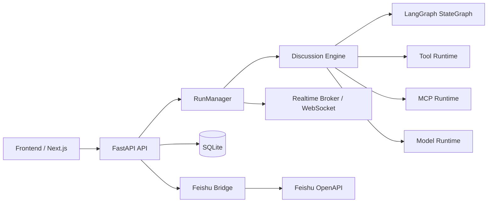

# AlignHub

**AlignHub** 是一个基于 **LangGraph** 的多智能体协同、共识收敛与联合决策平台，提供：

- Provider / Model 配置管理
- Agent、Tool、Skill、MCP 装配
- 多 Agent 会话编排与运行控制
- 实时事件流与运行回放
- Feishu 群聊 / 话题接入
- 本地工作区复制、运行后清理、Prompt 压缩与诊断能力

---

## 1. 当前能力概览

### 1.1 Provider / Model

已支持的 Provider 类型：

- `mock`
- `openai`
- `azure`
- `openrouter`
- `openai_compatible`
- `anthropic`
- `ollama`

能力包括：

- Provider 新增、编辑、删除、测试
- Model 新增、编辑、删除、测试
- 每个 Model 可配置：
  - `model_name`
  - `temperature`
  - `max_tokens`
  - `top_p`
  - `stream_enabled`
  - `formatter_type`
  - `extra_config_json`

---

### 1.2 Agent

Agent 支持以下配置：

- 名称、角色、Persona
- System Prompt
- 绑定 Model
- `memory_strategy`
- `max_steps`
- Moderator 标记
- Tool / Skill / MCP 挂载
- 独立 Feishu Agent Bot 绑定

能力包括：

- Agent CRUD
- Tool / Skill / MCP 关系同步
- Agent 详情查看
- Agent 独立 Feishu Bot 配置

---

### 1.3 内置 Tool

当前内置工具如下：

- `topic_probe`
- `list_files`
- `read_file`
- `write_file`
- `edit_file`
- `git_status`
- `git_log`
- `git_diff`
- `git_add`
- `git_commit`

特性：

- 文件工具受工作区边界约束，禁止越界访问
- Git 工具在运行工作区内执行
- Tool 调用会记录到 Tool Log

---

### 1.4 Skill

Skill 支持：

- 手工创建 / 编辑 / 删除
- 上传 zip 自动导入
- 自动识别 `SKILL.md / README.md / .md / .txt`
- 自动提取名称、描述、入口文件
- 删除时自动清理落盘产物

另外，运行时已对 Skill Prompt 做压缩控制：

- 单个 Skill 文本长度限制
- 总 Skill Prompt 长度限制
- 超限内容自动省略，避免 Prompt 膨胀

---

### 1.5 MCP

MCP 支持：

- `stdio`
- `http`
- `sse`

能力包括：

- MCP CRUD
- 上传 jar 自动生成 `stdio + java -jar` 配置
- 连接测试
- 调用测试
- 启动预览
- jar 删除后自动清理产物

---

### 1.6 Chat Session / Run

会话能力：

- Chat Session CRUD
- 配置参与 Agent 顺序
- 配置主题、轮数、状态
- 支持 Feishu 绑定字段：
  - `feishu_chat_id`
  - `feishu_topic_root_id`
  - `feishu_enabled`

运行能力：

- 启动 Run
- 停止 / 暂停 / 恢复
- 注入用户补充输入
- 查询事件流、Tool Logs、最终报告
- WebSocket 实时订阅运行事件
- 历史运行回放

运行时增强：

- 每次 Run 会复制受控工作区
- 默认在结束后自动清理运行工作区
- 支持运行过程中软中断并注入用户输入
- 支持最终报告汇总
- 讨论上下文采用“完整原文优先 + token 感知裁剪 + 最近原文 + 轮次总结 + 结构化状态 + 老历史检索”
- 不再对单条历史消息做半句式硬截断，优先保留完整原文
- 主持人每轮输出结构化结论，供后续轮次与最终报告复用

---

### 1.7 Feishu 集成

当前 Feishu 接入已支持：

- Host Bot 配置
- Agent Bot 独立配置
- 飞书事件回调
- URL verification
- 群聊 / 话题消息处理
- 自动绑定会话
- 自动创建会话
- 按群成员探测 Agent Bot
- 讨论运行事件回推飞书
- 按 Agent 身份发消息
- 诊断指定群里哪些 Agent Bot 已在群内

当前支持的群内命令：

- `#help`
- `#start 讨论主题`
- `开始讨论：讨论主题`
- `#ask Agent名称: 你的问题`
- `@Agent名称 你的问题`
- `@机器人名 你的问题`
- `暂停`
- `继续`
- `恢复`
- `停止`

运行中如果群成员继续发送普通文本，系统会：

- 自动识别为用户补充输入
- 对当前 Run 执行软暂停
- 注入上下文
- 再由后续指令恢复讨论

> 当前只支持 **明文事件模式**，不支持 Feishu Encrypt Key。

---

## 2. 架构说明

### 2.1 总体架构



---

### 2.2 后端关键模块

- `routes/`
  - API 路由层
- `runtime_langgraph.py`
  - LangGraph 运行控制、讨论执行、Checkpoint / 恢复，以及轮次总结 / 结构化状态维护
- `runtime_common.py`
  - 运行控制状态、事件落库、主持人结构化裁决模型与共享编排能力
- `services/langgraph_models.py`
  - LangChain / LangGraph 模型适配
- `services/builtin_tools.py`
  - 内置工具同步与注册
- `services/discussion_prompts.py`
  - 分层讨论上下文组装、Token 估算、老历史检索与最终报告拼装
- `services/mcp_runtime.py`
  - MCP 连接、调用、预览
- `services/workspace.py`
  - 工作区复制与清理
- `feishu.py`
  - Feishu 门面协调器
- `services/feishu_*.py`
  - Feishu 细分职责模块

---

### 2.3 Feishu 模块拆分

当前 Feishu 已完成第二轮瘦身，职责拆分为：

- `services/feishu_models.py`
  - 共享数据结构
- `services/feishu_commands.py`
  - 命令解析
- `services/feishu_callbacks.py`
  - 回调鉴权、会话引用解析
- `services/feishu_autobind.py`
  - 自动绑定、Agent 推断、话题提取、诊断
- `services/feishu_messaging.py`
  - 消息发送、运行事件转发、Token 与 OpenAPI 请求

`FeishuBridgeService` 现在主要作为门面与协调器存在。

---

### 2.4 讨论上下文策略

当前讨论上下文采用：**完整原文优先 + token 感知裁剪 + 最近原文 + 轮次总结 + 结构化状态 + 老历史检索**。

执行顺序如下：

1. 先尝试把完整历史原文直接注入 Prompt。
2. 如果超出 Token 预算，则退化为分层上下文：
   - `structured_state`：主题、轮次进度、共识、待确认问题、候选方案、风险等结构化状态
   - 最近若干条完整原文消息
   - 最近几轮主持人总结 `round_summaries`
   - 基于主题、最近发言和结构化状态检索出的较老历史片段
3. Agent 与 Moderator 使用独立 Prompt Token 预算，降低长讨论场景下的上下文膨胀风险。
4. 单条消息不再做半句式硬截断，避免模型误判“会话被截断”。

主持人当前会输出结构化字段：

- `key_points`
- `agreements`
- `disagreements`
- `open_questions`
- `candidate_options`
- `risks`

最终报告会同时包含：

- 当前累积的 `structured_state`
- 每轮主持人结论 `round_summaries`
- 按轮次整理的讨论摘录

---

## 3. 目录结构

```text
.
|- backend/
|  |- app/
|  |  |- api.py
|  |  |- core.py
|  |  |- db.py
|  |  |- entities.py
|  |  |- feishu.py
|  |  |- main.py
|  |  |- runtime_common.py
|  |  |- runtime_langgraph.py
|  |  |- schemas.py
|  |  |- routes/
|  |  `- services/
|  |     |- builtin_tools.py
|  |     |- discussion_prompts.py
|  |     |- feishu_auth.py
|  |     |- feishu_autobind.py
|  |     |- feishu_callbacks.py
|  |     |- feishu_commands.py
|  |     |- feishu_messaging.py
|  |     |- feishu_models.py
|  |     |- langgraph_models.py
|  |     |- langgraph_tools.py
|  |     |- mcp_runtime.py
|  |     |- runtime_probes.py
|  |     `- workspace.py
|  |- artifacts/
|  |- requirements.txt
|  `- README.md
|- frontend/
|  |- app/
|  |- components/
|  |- features/
|  |- lib/
|  `- package.json
|- FEISHU_SETUP.md
|- LICENSE
`- README.md
```

---

## 4. 技术栈

### 后端

- Python 3.12+
- FastAPI
- SQLAlchemy 2.x
- SQLite / aiosqlite
- LangGraph / LangChain
- pydantic-settings
- WebSocket

### 前端

- Next.js 16
- React 19
- TypeScript
- Tailwind CSS
- react-markdown
- remark-gfm

---

## 5. 快速启动

### 5.1 启动后端

```bash
cd backend
pip install -r requirements.txt
uvicorn app.main:app --host 0.0.0.0 --port 8000
```

可选：

```bash
cd backend
python run_server.py --host 0.0.0.0 --port 8000
```

Windows PowerShell：

```powershell
cd backend
.\start_backend.ps1
```

启动后地址：

- API Base: `http://127.0.0.1:8000/api/v1`
- Health: `http://127.0.0.1:8000/healthz`

后端启动日志会额外输出讨论检索运行态，例如：

- `mode=hybrid_fts_vector fts=on vector=on`
- `mode=fts_only fts=on vector=off`

用于确认当前环境下 `sqlite-vec` 是否真正启用，若不可用则会自动回退到 FTS / 词项检索。

当前多智能体上下文管理还包含两项观测增强：

- Saliency 采用阶段感知动态权重：前期偏重问题/风险，后期偏重结论/共识
- Density Penalty 对长代码块 / JSON / 配置片段增加白名单保护，避免高信息密度技术内容被误降权
- `state_patch_log` 会记录 Moderator adoption rate，便于分析某类 Agent Patch 是否长期不被采纳
- Semantic TTL 会在讨论后期更积极归档低优先级旧问题
- 混合检索对 FTS 保持更高权重；对错误码、模块名、路径等精确术语会进一步偏向 lexical 命中
- `conflicted` patch 会在 Moderator Prompt 中附带冲突裁决模板，要求结合相关轮次原文做最终判定
- 若 Moderator 仍未对冲突补丁作出清晰裁决，运行时会挂起为 `unresolved_conflict` 并置顶到下一轮焦点
- `user_input` 支持 `mark_important=true`，可把用户手动标记的重要消息提升为长期驻留关注点
- 前端实时讨论页支持点击历史消息直接“设为重点”，并支持展开查看未解决冲突详情

---

### 5.2 启动前端

```bash
cd frontend
npm install
npm run dev
```

前端默认地址：

- `http://127.0.0.1:3002`

生产构建：

```bash
cd frontend
npm run build
npm start
```

---

### 5.3 前端环境变量

```bash
NEXT_PUBLIC_API_BASE=http://127.0.0.1:8000/api/v1
```

---

## 6. 关键环境变量

后端所有环境变量都使用 `APP_` 前缀：

| 变量 | 默认值 | 说明 |
|---|---|---|
| `APP_APP_NAME` | `AlignHub Backend` | 应用名 |
| `APP_DATABASE_URL` | `sqlite+aiosqlite:///./backend.db` | 数据库连接串 |
| `APP_SECRET_KEY` | `dev-secret-key` | 本地敏感字段编码前缀 |
| `APP_WORKSPACE_ROOT` | 当前工作目录 | 运行工作区复制源目录 |
| `APP_ARTIFACT_ROOT` | `<cwd>/artifacts` | Skill / MCP / workspace 产物根目录 |
| `APP_MOCK_DISCUSSION_ROUND_CAP` | `2` | mock 讨论轮数上限 |
| `APP_MIN_DISCUSSION_ROUNDS` | `2` | 最小讨论轮数 |
| `APP_DISCUSSION_CONTEXT_MESSAGES` | `6` | 旧版固定历史窗口参数（兼容保留，当前分层上下文策略不再依赖） |
| `APP_DISCUSSION_AGENT_PROMPT_TOKEN_BUDGET` | `3200` | Agent 讨论 Prompt 的 Token 预算 |
| `APP_DISCUSSION_MODERATOR_PROMPT_TOKEN_BUDGET` | `4200` | 主持人 Prompt 的 Token 预算 |
| `APP_DISCUSSION_RECENT_FULL_MESSAGES` | `6` | 分层上下文中保留的最近完整原文消息数 |
| `APP_DISCUSSION_HISTORY_RETRIEVAL_ITEMS` | `6` | 从较老历史中检索回填的片段数量上限 |
| `APP_CLEANUP_RUN_WORKSPACE_ON_FINISH` | `true` | Run 结束后自动清理工作区 |
| `APP_SKILL_PROMPT_CHAR_LIMIT` | `1200` | 单个 Skill Prompt 长度上限 |
| `APP_SKILL_PROMPT_TOTAL_CHAR_LIMIT` | `3200` | Skill Prompt 总长度上限 |
| `APP_REPORT_MESSAGE_CHAR_LIMIT` | `400` | 最终报告中单条消息摘要长度上限 |

---

## 7. 主要页面

前端当前页面包括：

- `/`：首页
- `/providers`：Provider / Model 管理
- `/skills`：Skill 管理
- `/mcps`：MCP 管理
- `/agents`：Agent 管理
- `/sessions`：会话管理
- `/history`：历史运行列表
- `/runs/[runId]`：运行详情
- `/runs/[runId]/replay`：运行回放
- `/extensions/feishu`：Host Bot 配置
- `/extensions/feishu/bots`：Agent Bot 配置

---

## 8. 主要 API

### 8.1 Provider / Model

- `GET /api/v1/providers`
- `POST /api/v1/providers`
- `PUT /api/v1/providers/{provider_id}`
- `DELETE /api/v1/providers/{provider_id}`
- `POST /api/v1/providers/{provider_id}/test`
- `GET /api/v1/models`
- `POST /api/v1/models`
- `PUT /api/v1/models/{model_id}`
- `DELETE /api/v1/models/{model_id}`
- `POST /api/v1/models/{model_id}/test`

### 8.2 Tool / Skill / MCP / Agent

- `GET /api/v1/tools`
- `GET /api/v1/skills`
- `GET /api/v1/skills/{skill_id}`
- `POST /api/v1/skills`
- `POST /api/v1/skills/upload-zip`
- `PUT /api/v1/skills/{skill_id}`
- `DELETE /api/v1/skills/{skill_id}`
- `GET /api/v1/mcps`
- `GET /api/v1/mcps/{mcp_id}`
- `POST /api/v1/mcps`
- `POST /api/v1/mcps/upload-jar`
- `PUT /api/v1/mcps/{mcp_id}`
- `DELETE /api/v1/mcps/{mcp_id}`
- `POST /api/v1/mcps/{mcp_id}/test`
- `POST /api/v1/mcps/{mcp_id}/invoke-test`
- `POST /api/v1/mcps/{mcp_id}/startup-preview`
- `GET /api/v1/agents`
- `GET /api/v1/agents/{agent_id}`
- `POST /api/v1/agents`
- `PUT /api/v1/agents/{agent_id}`
- `DELETE /api/v1/agents/{agent_id}`
- `GET /api/v1/agents/{agent_id}/feishu-bot`
- `PUT /api/v1/agents/{agent_id}/feishu-bot`
- `DELETE /api/v1/agents/{agent_id}/feishu-bot`

### 8.3 Chat Session / Run

- `GET /api/v1/chat-sessions`
- `GET /api/v1/chat-sessions/{session_id}`
- `POST /api/v1/chat-sessions`
- `PUT /api/v1/chat-sessions/{session_id}`
- `DELETE /api/v1/chat-sessions/{session_id}`
- `POST /api/v1/chat-sessions/{session_id}/start`
- `GET /api/v1/runs`
- `GET /api/v1/runs/{run_id}`
- `DELETE /api/v1/runs/{run_id}`
- `POST /api/v1/runs/{run_id}/stop`
- `POST /api/v1/runs/{run_id}/pause`
- `POST /api/v1/runs/{run_id}/resume`
- `POST /api/v1/runs/{run_id}/user-input`
- `GET /api/v1/runs/{run_id}/events`
- `GET /api/v1/runs/{run_id}/tool-logs`
- `GET /api/v1/runs/{run_id}/report`
- `WS /api/v1/ws/runs/{run_id}`

### 8.4 Feishu

- `GET /api/v1/integrations/feishu/config`
- `PUT /api/v1/integrations/feishu/config`
- `GET /api/v1/integrations/feishu/agent-bots`
- `POST /api/v1/integrations/feishu/test-send`
- `POST /api/v1/integrations/feishu/diagnose-chat`
- `POST /api/v1/integrations/feishu/events`

### 8.5 Demo

- `POST /api/v1/demo/bootstrap`

---

## 9. Feishu 使用说明

更详细的飞书联调说明见：

- `FEISHU_SETUP.md`

这里仅保留系统级摘要。

### 9.1 当前接入模式

- 1 个 Host Bot 负责统一接收群事件
- 每个 Agent 可绑定独立 Agent Bot
- Agent 发言可按 Agent Bot 身份回推飞书
- 群未绑定会话时可自动创建会话
- 自动建会话优先按“群内真实存在的 Agent Bot”推断参与者

### 9.2 自动绑定与自动建会话

当前策略：

- 普通群：允许自动创建会话
- 话题群：只有 `start` 命令会触发自动创建
- 会优先探测各 Agent Bot 是否真的在群内
- 探测失败时回退为按消息内容推断 Agent

### 9.3 群内命令示例

```text
#help
#start 讨论多 Agent 平台如何接入 Feishu
开始讨论：讨论多 Agent 平台如何接入 Feishu
#ask 架构师: 这个方案最大的风险是什么？
@架构师 这个方案最大的风险是什么？
暂停
继续
恢复
停止
```

---

## 10. Demo 数据

可用以下命令快速生成一套本地演示数据：

```bash
curl -X POST http://127.0.0.1:8000/api/v1/demo/bootstrap
```

将自动创建：

- 1 个 mock Provider
- 1 个 mock Model
- 3 个演示 Agent
- 1 个演示 Chat Session

适合前后端联调和基本流程验收。

---

## 11. 数据与产物

当前系统会持久化以下核心数据：

- Provider
- Model
- ToolDefinition
- SkillDefinition
- MCPServerConfig
- Agent
- Agent-Tool / Agent-Skill / Agent-MCP 绑定
- ChatSession
- DiscussionRun
- DiscussionEvent
- ToolCallLog
- FinalReport
- Feishu Host 配置
- Feishu Agent Bot 配置
- FeishuMessageReceipt

文件产物主要落在：

- `backend/artifacts/skills`
- `backend/artifacts/mcps`
- `backend/artifacts/workspaces`

---

## 12. 当前约束与注意事项

- 默认数据库为 SQLite，适合单机开发与联调
- Feishu 目前仅支持明文事件，不支持事件加密
- jar 型 MCP 依赖本机可用 Java
- Git 工具依赖本机存在 `git`
- `mock` Provider 主要用于本地开发与演示
- 运行工作区默认会在结束后清理
- 讨论上下文已改为分层 Token 感知裁剪，但超长 Skill / MCP 描述仍应控制规模
- `APP_DISCUSSION_CONTEXT_MESSAGES` 为旧版固定窗口参数，兼容保留，不建议作为新的调优入口

---

## 13. 建议开发流程

1. 配置 Provider / Model
2. 配置 Skill / MCP
3. 创建 Agent 并挂载 Tool / Skill / MCP
4. 创建 Chat Session
5. 启动 Run
6. 在运行详情页观察事件流 / Tool Log / 报告
7. 如需外部协作，再接入 Feishu

---

## 14. 后续可继续演进的方向

- PostgreSQL / MySQL 替换 SQLite
- 更细粒度的权限控制
- Feishu 富文本 / 卡片消息
- 更强的 Skill 索引和版本管理
- 更丰富的 Run Replay 与审计视图
- 更完整的 Prompt 模板治理

---

## 15. License

本仓库的许可信息见根目录 `LICENSE`。
