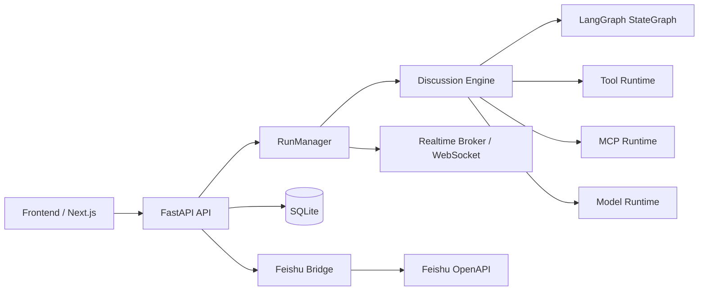

# AlignHub

**AlignHub** 是一个基于 **FastAPI + LangGraph + Next.js** 的多智能体协同、共识收敛与联合决策平台。它把模型配置、Agent 编排、会话运行、实时事件流、运行回放、Feishu 接入和工作区治理放到同一个控制台中，方便本地开发、演示验证与多智能体流程调试。

---

## 1. 当前能力概览

### 1.1 Provider / Model 管理

已支持的 Provider 类型：

- `mock`
- `openai`
- `azure`
- `openrouter`
- `openai_compatible`
- `anthropic`
- `ollama`

支持能力：

- Provider 新增、编辑、删除、测试
- Model 新增、编辑、删除、测试
- Model 参数配置：
  - `model_name`
  - `temperature`
  - `max_tokens`
  - `top_p`
  - `stream_enabled`
  - `formatter_type`
  - `extra_config_json`

---

### 1.2 Agent 编排

Agent 支持以下配置：

- 名称、角色、Persona
- System Prompt
- 绑定 Model
- `memory_strategy`
- `max_steps`
- Moderator 标记
- Tool / Skill / MCP 挂载
- 独立 Feishu Agent Bot 绑定

支持能力：

- Agent CRUD
- Tool / Skill / MCP 关系同步
- Agent 复制
- Agent 详情查看
- Agent 独立飞书 Bot 配置

---

### 1.3 内置 Tool

当前内置工具包括：

- `topic_probe`
- `list_files`
- `read_file`
- `write_file`
- `edit_file`
- `git_status`
- `git_log`
- `git_diff`
- `git_add`
- `git_commit`

特性：

- 文件工具受工作区边界约束，禁止越界访问
- Git 工具在运行工作区内执行
- Tool 调用会记录到 Tool Log

---

### 1.4 Skill

Skill 支持：

- 手工创建 / 编辑 / 删除
- 上传 zip 自动导入
- 自动识别 `SKILL.md / README.md / .md / .txt`
- 自动提取名称、描述、入口文件
- 删除时自动清理落盘产物

运行时还会对 Skill Prompt 做压缩控制：

- 单个 Skill 文本长度限制
- 总 Skill Prompt 长度限制
- 超限内容自动省略，避免 Prompt 膨胀

---

### 1.5 MCP

MCP 支持：

- `stdio`
- `http`
- `sse`

支持能力：

- MCP CRUD
- 上传 jar 自动生成 `java -jar` 形式的 stdio MCP 配置
- 连接测试
- 调用测试
- 启动预览
- jar 删除后自动清理产物

---

### 1.6 Chat Session / Run

会话能力：

- Chat Session CRUD
- 配置参与 Agent 顺序
- 配置主题、轮数、状态
- 显式校验会话中必须存在 Moderator

运行能力：

- 启动 Run
- 停止 / 暂停 / 恢复
- 注入用户补充输入
- 查询事件流、Tool Logs、最终报告
- WebSocket 实时订阅运行事件
- 历史运行回放
- 删除历史 Run

运行详情页支持：

- 聊天式时间线查看
- 运行控制（暂停 / 恢复 / 注入 / 停止）
- 消息“设为重点关注”
- 未解决冲突详情查看
- Tool Log 聚合查看
- 最终报告与结构化结论查看

运行回放页支持：

- 时间轴游标
- 自动播放 / 步进播放
- 回放中查看当前结构化状态快照
- 回放到结尾后查看最终报告

运行时增强：

- 每次 Run 会复制受控工作区
- 默认在结束后自动清理运行工作区
- 支持运行过程中软中断并注入用户输入
- 支持最终报告汇总
- 讨论上下文采用“完整原文优先 + token 感知裁剪 + 最近原文 + 轮次总结 + 结构化状态 + 老历史检索”
- 不再对单条历史消息做半句式硬截断，优先保留完整原文
- 主持人每轮输出结构化结论，供后续轮次与最终报告复用

---

### 1.7 Feishu 集成中心

当前 Feishu 能力已合并为一个统一入口：**飞书集成中心**。

页面标签包括：

- **全局配置**：Host Bot、Webhook、命令说明
- **Agent Bots**：每个 Agent 的独立机器人身份配置
- **测试诊断**：测试发消息、`chat_id` 诊断

支持能力：

- Host Bot 配置
- Agent Bot 独立配置
- 飞书事件回调
- URL verification
- 群聊 / 话题消息处理
- 自动绑定会话
- 自动创建会话
- 按群成员探测 Agent Bot
- 讨论运行事件回推飞书
- 按 Agent 身份发消息
- 诊断指定群里哪些 Agent Bot 已在群内

当前支持的群内命令：

- `#help`
- `#start 讨论主题`
- `开始讨论：讨论主题`
- `#ask Agent名称: 你的问题`
- `@Agent名称 你的问题`
- `@机器人名 你的问题`
- `暂停`
- `继续`
- `恢复`
- `停止`

> 当前只支持 **明文事件模式**，暂不支持 Feishu Encrypt Key。

---

## 2. 前端当前页面

- `/`：首页
- `/providers`：Provider / Model 管理
- `/skills`：Skill 管理
- `/mcps`：MCP 管理
- `/agents`：Agent 管理
- `/sessions`：会话管理
- `/history`：历史运行列表
- `/runs/[runId]`：运行详情
- `/runs/[runId]/replay`：运行回放
- `/extensions/feishu`：飞书集成中心（Tabs）
- `/extensions/feishu/bots`：兼容入口，会跳转到 `/extensions/feishu?tab=agents`

当前前端还补齐了：

- 品牌化视觉统一
- 按钮 / 表单 / 卡片统一状态反馈
- Toast 成功/失败提示
- 骨架屏加载态
- 更细的空状态
- 运行时间线 / 历史列表渐入动效

---

## 3. 总体架构



---

## 4. 后端关键模块

### 4.1 路由层

- `routes/providers.py`
  - Provider / Model 管理与测试
- `routes/assets.py`
  - Tool / Skill / MCP 管理、zip / jar 上传、MCP 测试
- `routes/agents.py`
  - Agent 管理与 Agent Feishu Bot 绑定
- `routes/sessions_runs.py`
  - Chat Session / Run / Event / Report / Tool Log / WebSocket
- `routes/feishu_integration.py`
  - Feishu 全局配置、Agent Bot 列表、测试发送、群诊断、事件回调
- `routes/demo.py`
  - 本地 Demo 数据初始化

### 4.2 运行时与服务层

- `runtime_langgraph.py`
  - LangGraph 运行控制、讨论执行、Checkpoint / 恢复
- `runtime_common.py`
  - 运行控制状态、事件落库、事件服务
- `services/langgraph_models.py`
  - 模型适配
- `services/langgraph_tools.py`
  - LangGraph 工具桥接
- `services/builtin_tools.py`
  - 内置工具同步与注册
- `services/discussion_prompts.py`
  - 讨论 Prompt 组装
- `services/context_retrieval.py`
  - FTS / sqlite-vec / 混合检索运行态
- `services/discussion_state.py`
  - 结构化状态维护
- `services/discussion_turn_service.py`
  - 单轮讨论推进逻辑
- `services/run_lifecycle.py`
  - Run 生命周期管理
- `services/run_persistence.py`
  - Run 数据持久化
- `services/run_execution_notifier.py`
  - 运行通知
- `services/mcp_runtime.py`
  - MCP 连接、调用、预览
- `services/workspace.py`
  - 工作区复制与清理
- `feishu.py` + `services/feishu_*`
  - Feishu 门面、命令解析、回调处理、消息发送、自动绑定、诊断

---

## 5. 讨论上下文策略

当前讨论上下文采用：

**完整原文优先 + token 感知裁剪 + 最近原文 + 轮次总结 + 结构化状态 + 老历史检索**

执行顺序：

1. 优先尝试把完整历史原文直接注入 Prompt
2. 超出 Token 预算时退化为分层上下文：
   - `structured_state`
   - 最近若干条完整原文消息
   - 最近几轮主持人总结 `round_summaries`
   - 基于主题、最近发言和结构化状态检索出的老历史片段
3. Agent 与 Moderator 使用独立 Token 预算
4. 单条消息不做半句式硬截断

主持人输出的结构化字段包括：

- `key_points`
- `agreements`
- `disagreements`
- `open_questions`
- `candidate_options`
- `risks`

最终报告会同时包含：

- 当前累积的 `structured_state`
- 每轮主持人结论 `round_summaries`
- 按轮次整理的讨论摘录

---

## 6. 目录结构

```text
.
|- backend/
|  |- app/
|  |  |- api.py
|  |  |- core.py
|  |  |- db.py
|  |  |- entities.py
|  |  |- feishu.py
|  |  |- main.py
|  |  |- runtime_common.py
|  |  |- runtime_langgraph.py
|  |  |- routes/
|  |  `- services/
|  |- artifacts/
|  |- docs/
|  |- scripts/
|  |- tests/
|  |- requirements.txt
|  `- run_server.py
|- frontend/
|  |- app/
|  |- components/
|  |- features/
|  |- lib/
|  `- package.json
|- FEISHU_SETUP.md
|- LICENSE
`- README.md
```

---

## 7. 技术栈

### 后端

- Python 3.12+
- FastAPI
- SQLAlchemy 2.x
- SQLite / aiosqlite
- LangGraph / LangChain
- sqlite-vec
- pydantic-settings
- WebSocket

### 前端

- Next.js 16
- React 19
- TypeScript
- Tailwind CSS 4
- react-markdown
- remark-gfm

---

## 8. 快速启动

### 8.1 启动后端

```bash
cd backend
pip install -r requirements.txt
uvicorn app.main:app --host 0.0.0.0 --port 8000
```

或：

```bash
cd backend
python run_server.py --host 0.0.0.0 --port 8000
```

启动后地址：

- API Base: `http://127.0.0.1:8000/api/v1`
- Health: `http://127.0.0.1:8000/healthz`

### 8.2 启动前端

```bash
cd frontend
npm install
npm run dev
```

前端默认地址：

- `http://127.0.0.1:3003`

生产构建：

```bash
cd frontend
npm run build
npm start
```

### 8.3 前端环境变量

```bash
NEXT_PUBLIC_API_BASE=http://127.0.0.1:8000/api/v1
```

---

## 9. 关键环境变量

后端环境变量统一使用 `APP_` 前缀。

| 变量 | 默认值 | 说明 |
|---|---|---|
| `APP_APP_NAME` | `AlignHub Backend` | 应用名 |
| `APP_DATABASE_URL` | `sqlite+aiosqlite:///./backend.db` | 数据库连接串 |
| `APP_SECRET_KEY` | `dev-secret-key` | 本地敏感字段编码前缀 |
| `APP_WORKSPACE_ROOT` | 当前工作目录 | 运行工作区复制源目录 |
| `APP_ARTIFACT_ROOT` | `<cwd>/artifacts` | Skill / MCP / workspace 产物根目录 |
| `APP_MOCK_DISCUSSION_ROUND_CAP` | `2` | mock 讨论轮数上限 |
| `APP_MIN_DISCUSSION_ROUNDS` | `2` | 最小讨论轮数 |
| `APP_DISCUSSION_AGENT_PROMPT_TOKEN_BUDGET` | `3200` | Agent Prompt Token 预算 |
| `APP_DISCUSSION_MODERATOR_PROMPT_TOKEN_BUDGET` | `4200` | Moderator Prompt Token 预算 |
| `APP_DISCUSSION_RECENT_FULL_MESSAGES` | `6` | 分层上下文中保留的最近完整原文消息数 |
| `APP_DISCUSSION_HISTORY_RETRIEVAL_ITEMS` | `6` | 较老历史回填片段数量上限 |
| `APP_CLEANUP_RUN_WORKSPACE_ON_FINISH` | `true` | Run 结束后自动清理工作区 |
| `APP_SKILL_PROMPT_CHAR_LIMIT` | `1200` | 单个 Skill Prompt 长度上限 |
| `APP_SKILL_PROMPT_TOTAL_CHAR_LIMIT` | `3200` | Skill Prompt 总长度上限 |
| `APP_REPORT_MESSAGE_CHAR_LIMIT` | `400` | 报告中单条消息摘要长度上限 |

---

## 10. 主要 API 概览

### 10.1 Provider / Model

- `GET /api/v1/providers`
- `POST /api/v1/providers`
- `PUT /api/v1/providers/{provider_id}`
- `DELETE /api/v1/providers/{provider_id}`
- `POST /api/v1/providers/{provider_id}/test`
- `GET /api/v1/models`
- `POST /api/v1/models`
- `PUT /api/v1/models/{model_id}`
- `DELETE /api/v1/models/{model_id}`
- `POST /api/v1/models/{model_id}/test`

### 10.2 Tool / Skill / MCP / Agent

- `GET /api/v1/tools`
- `GET /api/v1/skills`
- `GET /api/v1/skills/{skill_id}`
- `POST /api/v1/skills`
- `POST /api/v1/skills/upload-zip`
- `PUT /api/v1/skills/{skill_id}`
- `DELETE /api/v1/skills/{skill_id}`
- `GET /api/v1/mcps`
- `GET /api/v1/mcps/{mcp_id}`
- `POST /api/v1/mcps`
- `POST /api/v1/mcps/upload-jar`
- `PUT /api/v1/mcps/{mcp_id}`
- `DELETE /api/v1/mcps/{mcp_id}`
- `POST /api/v1/mcps/{mcp_id}/test`
- `POST /api/v1/mcps/{mcp_id}/invoke-test`
- `POST /api/v1/mcps/{mcp_id}/startup-preview`
- `GET /api/v1/agents`
- `GET /api/v1/agents/{agent_id}`
- `POST /api/v1/agents`
- `PUT /api/v1/agents/{agent_id}`
- `DELETE /api/v1/agents/{agent_id}`
- `GET /api/v1/agents/{agent_id}/feishu-bot`
- `PUT /api/v1/agents/{agent_id}/feishu-bot`
- `DELETE /api/v1/agents/{agent_id}/feishu-bot`

### 10.3 Chat Session / Run

- `GET /api/v1/chat-sessions`
- `GET /api/v1/chat-sessions/{session_id}`
- `POST /api/v1/chat-sessions`
- `PUT /api/v1/chat-sessions/{session_id}`
- `DELETE /api/v1/chat-sessions/{session_id}`
- `POST /api/v1/chat-sessions/{session_id}/start`
- `GET /api/v1/runs`
- `GET /api/v1/runs/{run_id}`
- `DELETE /api/v1/runs/{run_id}`
- `POST /api/v1/runs/{run_id}/stop`
- `POST /api/v1/runs/{run_id}/pause`
- `POST /api/v1/runs/{run_id}/resume`
- `POST /api/v1/runs/{run_id}/user-input`
- `GET /api/v1/runs/{run_id}/events`
- `GET /api/v1/runs/{run_id}/tool-logs`
- `GET /api/v1/runs/{run_id}/report`
- `WS /api/v1/ws/runs/{run_id}`

### 10.4 Feishu

- `GET /api/v1/integrations/feishu/config`
- `PUT /api/v1/integrations/feishu/config`
- `GET /api/v1/integrations/feishu/agent-bots`
- `POST /api/v1/integrations/feishu/test-send`
- `POST /api/v1/integrations/feishu/diagnose-chat`
- `POST /api/v1/integrations/feishu/events`

### 10.5 Demo

- `POST /api/v1/demo/bootstrap`

---

## 11. Demo 数据

可用以下命令快速生成一套本地演示数据：

```bash
curl -X POST http://127.0.0.1:8000/api/v1/demo/bootstrap
```

将自动创建：

- 1 个 mock Provider
- 1 个 mock Model
- 3 个演示 Agent
- 1 个演示 Chat Session

适合前后端联调和基本流程验收。

---

## 12. 数据与产物

系统当前会持久化以下核心数据：

- Provider
- Model
- ToolDefinition
- SkillDefinition
- MCPServerConfig
- Agent
- Agent-Tool / Agent-Skill / Agent-MCP 绑定
- ChatSession
- DiscussionRun
- DiscussionEvent
- ToolCallLog
- FinalReport
- Feishu Host 配置
- Feishu Agent Bot 配置
- FeishuMessageReceipt

文件产物主要落在：

- `backend/artifacts/skills`
- `backend/artifacts/mcps`
- `backend/artifacts/workspaces`

---

## 13. 当前约束与注意事项

- 默认数据库为 SQLite，适合单机开发与联调
- Feishu 当前仅支持明文事件，不支持事件加密
- jar 型 MCP 依赖本机可用 Java
- Git 工具依赖本机存在 `git`
- `mock` Provider 主要用于本地开发与演示
- 运行工作区默认会在结束后清理
- 讨论上下文已改为分层 Token 感知裁剪，但超长 Skill / MCP 描述仍应控制规模

---

## 14. 建议开发流程

1. 配置 Provider / Model
2. 配置 Skill / MCP
3. 创建 Agent 并挂载 Tool / Skill / MCP
4. 创建 Chat Session，并确保包含 Moderator
5. 启动 Run
6. 在运行详情页观察事件流 / Tool Log / 报告
7. 如需外部协作，再进入飞书集成中心完成接入与测试

---

## 15. 相关文档

- `FEISHU_SETUP.md`：飞书联调说明
- `backend/README.md`：后端补充说明

---

## 16. License

本仓库的许可信息见根目录 `LICENSE`。
