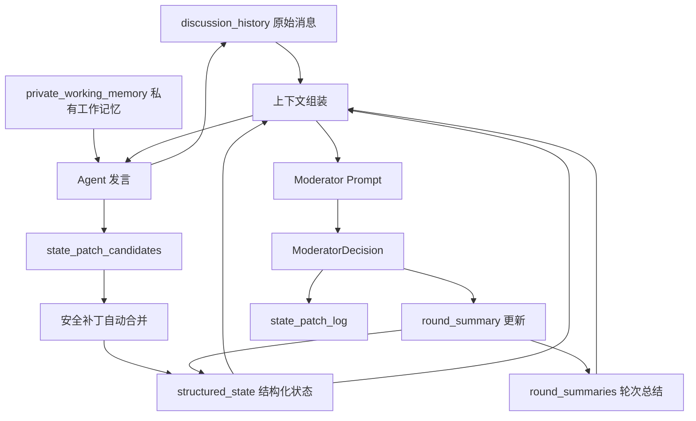
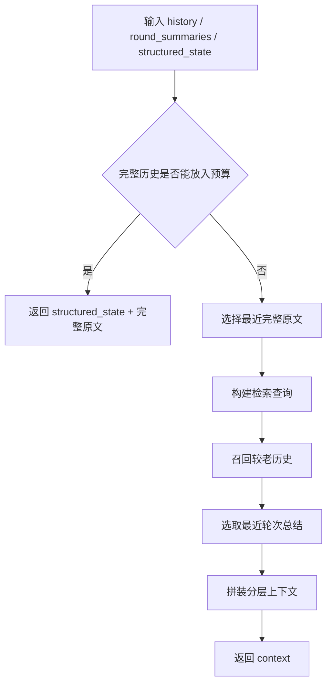

# 多智能体群聊上下文管理技术设计

## 1. 文档信息

- 文档名称：多智能体群聊上下文管理技术设计
- 所属项目：AlignHub
- 适用范围：LangGraph 多智能体讨论运行时
- 对应实现：
  - `backend/app/services/discussion_prompts.py`
  - `backend/app/runtime_langgraph.py`
  - `backend/app/runtime_common.py`
  - `backend/app/core.py`

---

## 2. 背景

多智能体群聊在讨论轮次增加后，传统上下文管理方式会出现以下问题：

1. **全量原文直接喂入 Prompt**：上下文随轮次线性膨胀，容易超出模型预算。
2. **只保留最近 N 条消息**：较早但关键的结论、风险、分歧会被直接丢失。
3. **对单条消息做硬截断**：容易形成半句、残句，模型可能误判为“会话被截断”。
4. **缺少结构化沉淀**：每轮讨论都要重新从原文中提炼共识，导致重复推理与重复发言。
5. **老历史无法按需召回**：重要早期内容在长会话中无法稳定回填。

为解决上述问题，当前系统引入了分层上下文管理机制。

---

## 3. 设计目标

### 3.1 总体目标

构建一套适用于多智能体轮流讨论的上下文管理方案，在保证讨论连续性的同时控制 Prompt 成本，并支持主持人总结、运行恢复和最终报告复用。

### 3.2 目标原则

当前方案遵循以下统一原则：

> **完整原文优先 + Token 感知裁剪 + 最近原文 + 轮次总结 + 结构化状态 + 老历史检索**

### 3.3 具体目标

1. 优先保留完整历史原文，预算足够时不做摘要替代。
2. 上下文超预算时，退化为分层上下文而非粗暴截断。
3. 最近对话保留完整原文，确保当前讨论连续性。
4. 通过主持人每轮裁决沉淀轮次总结，降低重复讨论。
5. 维护结构化状态，为后续轮次和最终报告提供稳定输入。
6. 对较老历史进行轻量召回，补齐早期关键结论。
7. 支持暂停、恢复、用户插话、断点恢复等运行控制场景。

### 3.4 非目标

当前版本暂不追求：

1. 基于真实模型 tokenizer 的精确 token 计量。
2. 向量库 / Embedding / Rerank 级别的复杂记忆检索。
3. 议题树、论证图等更高阶知识结构建模。

---

## 4. 总体方案概览

系统将讨论上下文分为七层：

1. **原始会话层**：保存所有真实发言原文。
2. **轮次总结层**：主持人每轮输出结构化裁决并沉淀摘要。
3. **结构化状态层**：跨轮维护主题、共识、风险、候选方案等状态。
4. **Agent 私有工作记忆层**：为每个 Agent 保存私有草稿、工具结果缓存、本轮关注点与个体分析偏好。
5. **提案式黑板层**：Agent 可提出状态补丁提案，运行时进行受控合并与审计。
6. **检索回填层**：从较老历史中按主题相关性召回片段。
7. **Prompt 组装层**：根据预算动态生成 Agent / Moderator 的上下文。

### 4.1 运行时高层流程



---

## 5. 数据模型设计

## 5.1 DiscussionState

运行时主状态定义于 `runtime_langgraph.py`，关键字段如下：

- `run_id`
- `session_id`
- `session_name`
- `topic`
- `max_rounds`
- `min_required_rounds`
- `round_no`
- `agent_index`
- `discussion_agent_ids`
- `moderator_agent_id`
- `discussion_history`
- `round_summaries`
- `structured_state`
- `private_working_memory`
- `state_patch_candidates`
- `state_patch_log`
- `workspace_root`
- `finished`
- `moderator_decision`

其中，和上下文管理直接相关的是：

- `discussion_history`
- `round_summaries`
- `structured_state`
- `private_working_memory`
- `state_patch_candidates`
- `state_patch_log`
- `moderator_decision`

---

## 5.2 discussion_history：原始消息层

`discussion_history` 保存群聊中的原始发言，元素结构示意如下：

```json
{
  "round_no": 3,
  "agent_id": "agent_xxx",
  "agent_name": "架构师",
  "text": "当前建议优先采用模块化和可审计的实现路径。"
}
```

特点：

1. 保存原文，不做中途改写。
2. Agent 发言、用户补充输入都会进入该历史。
3. 在 Prompt 预算允许时，优先直接使用该层完整原文。

用户插话写入格式如下：

```json
{
  "round_no": 3,
  "agent_id": "user",
  "agent_name": "用户补充",
  "text": "请重点比较成本和性能基线。"
}
```

---

## 5.3 round_summaries：轮次总结层

每轮讨论结束后，主持人输出结构化裁决，系统将其转为 `round_summary` 记录并追加到 `round_summaries` 中。

结构示意：

```json
{
  "round_no": 3,
  "summary_text": "主持人裁决：本轮暂不结束。下一轮聚焦：补充性能基线。",
  "decision_reason": "结论尚未收敛，缺少性能基线。",
  "next_focus": "补充性能基线",
  "finished": false,
  "key_points": [],
  "agreements": [],
  "disagreements": [],
  "open_questions": [],
  "candidate_options": [],
  "risks": []
}
```

作用：

1. 作为历史压缩层沉淀阶段性结论。
2. 为后续轮次提供稳定摘要，而非重复扫描全部原文。
3. 为最终报告生成提供结构化素材。

---

## 5.4 structured_state：结构化状态层

`structured_state` 是跨轮维护的全局状态，初始化于运行开始时，之后每轮由主持人裁决持续更新。

当前字段包括：

```json
{
  "topic": "",
  "rounds_completed": 0,
  "participant_names": [],
  "latest_decision": "in_progress",
  "latest_decision_reason": "",
  "next_focus": null,
  "agreements": [],
  "open_questions": [],
  "candidate_options": [],
  "risks": [],
  "recent_key_points": [],
  "last_round_summary": "",
  "agreement_items": [],
  "open_question_items": [],
  "candidate_option_items": [],
  "risk_items": []
}
```

作用：

1. 表达“讨论当前局势”。
2. 把长文本原文转化为可复用的机器可读状态。
3. 让 Agent 和 Moderator 能快速理解当前共识、未决问题与风险。
4. 通过 `*_items` 元数据支持基础语义 TTL 和活跃态筛选。

---

## 5.5 ModeratorDecision：主持人结构化裁决协议

`runtime_common.py` 中定义了主持人标准输出模型：

```python
class ModeratorDecision(BaseModel):
    finished: bool
    reason: str | None
    next_focus: str | None
    key_points: list[str]
    agreements: list[str]
    disagreements: list[str]
    open_questions: list[str]
    candidate_options: list[str]
    risks: list[str]
```

字段语义如下：

| 字段 | 含义 |
|---|---|
| `finished` | 当前讨论是否可以结束 |
| `reason` | 裁决原因 |
| `next_focus` | 若未结束，下一轮建议聚焦点 |
| `key_points` | 本轮关键观点 |
| `agreements` | 当前形成的共识 |
| `disagreements` | 当前仍存在的分歧 |
| `open_questions` | 尚未回答的问题 |
| `candidate_options` | 候选方案 |
| `risks` | 风险点 |

---

## 5.6 private_working_memory：Agent 私有工作记忆层

当前运行时为每个 Agent 增加 `private_working_memory`，结构位于 `DiscussionState` 内部，按 `agent_id` 建立映射。

结构示意：

```json
{
  "agent_id_xxx": {
    "draft_notes": [],
    "tool_result_cache": [],
    "current_focus": [],
    "analysis_preferences": []
  }
}
```

### 作用范围

私有工作记忆严格限定为以下四类信息：

1. **临时草稿**
2. **工具结果缓存**
3. **本轮关注点**
4. **个体分析偏好**

### 设计边界

该层不是共享事实层，不直接进入：

- `discussion_history`
- `round_summaries`
- `structured_state`

只有当 Agent 在公开发言中明确表达了相关关键信息，这些内容才会经过公开链路进入共享上下文，并被主持人总结与最终报告消费。

### 设计原则

1. **共享记忆为主，私有记忆为辅**
2. 私有记忆只服务于 Agent 的本地工作组织，不承载会话事实主干
3. 如果私有记忆影响公开发言，必须通过公开消息显式说出来

### 这样设计的原因

如果把会话核心事实长期保存在 Agent 私有记忆中，会带来：

1. 事实不一致
2. 主持人与其他 Agent 无法对齐
3. 回放与最终报告难以解释

因此，私有工作记忆只允许承载“工作缓存”，不允许取代共享事实层。

---

## 5.7 state_patch_candidates / state_patch_log：提案式黑板层

为降低 Moderator 单点风险，当前运行时增加了基础版“提案式黑板”机制。

### `state_patch_candidates`

用于暂存 Agent 提出的状态补丁候选，结构示意如下：

```json
{
  "id": "patch_xxx",
  "round_no": 3,
  "agent_id": "agent_xxx",
  "agent_name": "架构师",
  "source_message_id": "msg_xxx",
  "target_field": "open_questions",
  "operation": "add",
  "value": "是否需要先补压测",
  "reason": "公开发言中提出当前仍缺少压测基线",
  "confidence": 0.55,
  "evidence_refs": ["msg_xxx"],
  "status": "pending",
  "risk_level": "low"
}
```

### `state_patch_log`

用于记录补丁处理结果，便于审计和调试。当前支持的典型决策包括：

- `accepted_auto`
- `accepted_by_moderator`
- `rejected_by_moderator`

当前日志项还会追加以下观测字段：

- `proposal_agent_id`
- `proposal_agent_name`
- `moderator_adoption_rate`
- `moderator_adoption_rate_by_agent`
- `moderator_adoption_rate_by_field`

其目的不是让运行时直接改变 Moderator 行为，而是为后续诊断提供依据：

1. 若某个 Agent 的 patch 长期 adoption rate 很低，可能意味着该 Agent 的 Prompt 引导有误
2. 若某个字段（如 `risks`）长期 adoption rate 很低，可能意味着 Moderator 过于保守或存在偏置
3. 这些聚合指标也会同步写入 `structured_state.patch_metrics`

### unresolved_conflict 挂起机制

若某组 `conflicted` patch 已提交给 Moderator，但最终裁决仍满足以下条件之一：

1. `reason` 过于含糊
2. `structured_state` 中没有明确吸收任何一方观点
3. 冲突没有被转写为可继续验证的 `open_question` / `next_focus`

则运行时会触发降级逻辑：

1. 将该冲突摘要写入 `structured_state.unresolved_conflicts`
2. 追加 `state_patch_log.decision = unresolved_conflict`
3. 强制把该议题置顶到下一轮 `next_focus`

这样可以避免冲突在“主持人话术含糊”时被静默吞掉。

### 当前实现边界

当前代码实现的是**基础版提案式黑板**：

1. Agent 可通过输出协议附带状态补丁提案。
2. 运行时会自动合并一部分低风险 `add` 类型补丁。
3. 其余补丁作为“待审状态补丁提案”提供给 Moderator 参考。
4. Moderator 裁决后，运行时会根据最终状态结果对补丁做接受/拒绝归档。

### 当前冲突检测

自动合并前，运行时会先执行一轮基础冲突检测：

1. **机械冲突**
   - 同一 `target_field + value`
   - 但 `operation` 相反
2. **轻量语义冲突**
   - 例如一条 patch 提出 `add agreement: 方案A可行`
   - 同轮另一条 patch 提出 `add risk: 方案A不可行，存在回滚风险`

若检测到上述冲突：

- patch 会被标记为 `conflicted`
- `risk_level` 提升为 `high`
- 不再自动合并
- 强制交给 Moderator 间接裁决

### 当前粒度与下一步方向

当前实现仍然是**轻量语义冲突检测**，主要依赖：

1. 关键词重叠
2. 否定约束词
3. 少量正反向反义词对

例如：

- `可行` / `不可行`
- `已解决` / `未解决`
- `可接受` / `不可接受`
- `收敛` / `未收敛`

该机制比单纯字面匹配更强，但还不是完整语义理解；后续若成本允许，可进一步升级为：

- Embedding 相似度辅助判定
- 小模型 patch 合法性校验

这意味着：

- Agent **不能直接写** `structured_state`
- 共享状态仍然由运行时受控合并
- 冲突或高风险更新仍由 Moderator 兜底

---

## 6. 上下文组装设计

核心实现位于 `discussion_prompts.py`，主函数为：

- `format_discussion_context(...)`
- `build_agent_turn_prompt(...)`
- `build_moderator_prompt(...)`

---

## 6.1 Token 估算

当前方案使用启发式 Token 估算函数 `estimate_token_count(text)`：

1. 中文字符按 1 token 近似。
2. 英文/数字词按 1 token 近似。
3. 其他字符按约 4 字符 1 token 粗估。

### 设计考虑

- 优点：实现轻量、运行快、无外部 tokenizer 依赖。
- 局限：不是精确 tokenizer，只能用于预算裁剪的近似判断。

---

## 6.2 上下文构造总流程

`format_discussion_context(...)` 的执行流程如下：



---

## 6.3 第一优先级：完整原文优先

系统首先会将全部历史消息格式化为完整原文块：

```text
[Round 1] 架构师:
...

[Round 1] 产品经理:
...
```

然后再拼接结构化状态块。如果总预算允许，则直接返回：

1. `structured_state`
2. `full history`

### 设计价值

1. 在短会话或中等长度会话中，避免不必要的信息压缩。
2. 最大限度保留真实对话语义。
3. 避免摘要误差和信息遗漏。

---

## 6.4 第二优先级：分层上下文退化

如果完整历史超出预算，则退化为以下四层：

1. `structured_state`
2. `recent + salient full messages`
3. `recent round summaries`
4. `older retrieved memories`

### 分层设计原则

1. 结构化状态负责给出全局局势。
2. 最近原文负责保证当前轮次的连续性，并允许插入高重要度旧消息。
3. 轮次总结负责压缩中期历史。
4. 老历史检索负责补回早期关键结论。

---

## 6.5 最近完整原文选择（含 Saliency Scoring）

函数：`_select_recent_messages(...)`

策略：

1. 从 `discussion_history` 尾部开始倒序扫描。
2. 优先保留最近若干条完整消息，保证当前连续性。
3. 额外保留少量“锚点消息”和“高重要度历史消息”。
4. 同时受两类约束：
   - 条数上限
   - Token 预算上限
5. 不对单条消息做半句式裁断。

### 规则版 Saliency Scoring

当前版本没有引入额外小模型，而是采用**规则版消息重要度打分**：

- 高分信号：
  - 提出方案
  - 提出风险
  - 给出证据/数据/压测结论
  - 提出问题
  - 表达反对/冲突
  - 用户补充输入
- 低分信号：
  - “收到”
  - “同意”
  - 简短礼貌性回应

### 阶段感知动态权重

在规则版基础上，当前实现增加了 discussion phase-aware 调权：

1. **讨论前期**（靠近第 1 轮）
   - 提问 / 风险 / 异议获得更高权重
   - 目标是尽早暴露未知项、约束和分歧
2. **讨论中期**
   - 方案 / 证据类消息获得更高权重
   - 目标是推动比较、验证和收敛
3. **讨论后期**（接近 `max_rounds`）
   - 结论 / 共识类消息显著加权
   - 一般性问题会适度降权，但不会被直接归零

这样可以避免：

- 前期还没展开，就被“看似结论”的消息提前带偏
- 后期已经接近轮次上限，却仍被大量低价值问题占据上下文

### Density Penalty 白名单保护

为避免“长消息 = 低密度”的误判，当前实现对以下技术型内容增加白名单保护：

1. fenced code block（如 ```python ... ```）
2. 可成功解析的长 JSON / 数组 payload
3. 多行配置片段、堆栈、路径、键值对密集内容

处理策略：

1. 先按规则计算基础 Saliency
2. 当消息因“很长但信号少”即将触发 Density Penalty 时，再检测是否属于代码 / JSON / 配置型高熵内容
3. 若命中白名单，则跳过或显著减轻密度惩罚

这样可以避免：

- 长代码块被误判为“冗长废话”
- 复杂 JSON / 错误载荷因关键词较少而长期进不了上下文
- 配置、堆栈、错误码等高价值技术证据被过度压制

### 与 Semantic TTL 的联动

当前阶段感知不仅作用于消息选择，也会影响状态归档：

1. 进入讨论后期后，`open_question_items` 的 TTL 会更激进
2. `candidate_option_items` 也会适度提高归档积极度
3. 仅对**低重要度、低支持度、长期未被再次提及**的条目生效
4. 若某项恰好等于 `next_focus`，仍会被保护，不会因为晚期 TTL 被误归档

这使得系统在接近 `max_rounds` 时，能够更主动地为“方案对比 / 最终裁决”腾出状态空间。

### 密度惩罚（Density Penalty）

为避免“冗长但只有少量关键词”的消息长期霸占上下文，当前规则版 Saliency Scoring 已加入基础密度惩罚：

1. 如果消息很长，但高价值信号命中数很少，则会适度扣分。
2. 惩罚目标不是“长消息”，而是“低信息密度的长消息”。
3. 因此：
   - 长且高价值的消息仍可保留较高分
   - 长但空泛的消息会更容易让位给更精炼的关键消息

消息会携带：

- `saliency_score`
- `message_kind`

用于辅助上下文选择。

### 设计原因

最近消息最能决定当前讨论的上下文依赖，但关键旧消息同样可能决定讨论方向，因此当前策略是“**最近 + 高重要度**”混合保留。

---

## 6.6 最近轮次总结选择

系统会从 `round_summaries` 中取最近若干轮，保留：

- `summary_text`
- `key_points`
- `agreements`
- `open_questions`
- `candidate_options`
- `risks`
- `next_focus`

### 设计原因

1. 中期历史通常不必全部用原文保留。
2. 主持人总结更适合作为压缩视图。
3. 有助于减少模型重复推理“上一轮已经讨论过什么”。

---

## 6.7 老历史检索设计

函数：`_retrieve_older_memories(...)`

当前版本已升级为**SQLite 混合检索**：

1. **FTS 检索**：基于 `lexical_text` 做精确词项/短语召回
2. **sqlite-vec 检索**：在扩展可用时，基于轻量哈希向量做近邻召回
3. **词项回退**：当侧车 SQLite 或 `sqlite-vec` 不可用时，退回进程内词项重叠检索

### 查询构建

查询文本由以下内容拼接得到：

1. `topic`
2. 最新一条发言
3. `structured_state.next_focus`
4. `agreements`
5. `open_questions`
6. `candidate_options`
7. `risks`
8. `recent_key_points`

### 候选来源

1. 较老的原始消息
2. 历史轮次总结
3. `structured_state` 中的 archived items

### 排序逻辑

当前采用混合排序：

1. FTS 命中的 reciprocal-rank 分数
2. 向量命中的 reciprocal-rank 分数（若 sqlite-vec 可用）
3. `saliency_score` 加权
4. `round_no` / `ordinal` recency bias
5. `source_type` 权重（如 `round_summary` 略加权）
6. archived penalty（避免旧结论过强压制当前上下文）

### FTS 权重优先策略

考虑到当前向量层仍是**轻量哈希向量**，存在 collision 风险，当前融合排序对 FTS 保持更高权重。

此外，当 query 中出现以下特征时，会进一步提高 lexical 权重：

1. 模块名 / 路径
2. 错误码 / 数字字母混合 token
3. `_`、`.`、`/`、`:` 等工程术语结构
4. 大写缩写 token

这样做的目标是：

- 保证业务术语、错误码、文件路径的精确命中优先
- 仍保留 sqlite-vec 对语义改写和远距离关联的补充价值

### Entity 二次加权与静态锚点

由于当前向量层仍采用轻量哈希 embedding，系统额外增加了两类增强：

1. **Entity 二次加权**
   - 对错误码、模块名、路径、数字字母混合 token 做更高权重写入
2. **静态向量锚点**
   - 查询侧会把 `topic`、`agreements`、`user_pinned_points` 转换为锚点 terms
   - 这些锚点不会替代原始查询，而是作为额外向量偏置，避免召回偏离主议题或既有共识

### 中文处理

为兼顾中文召回效果，当前实现会：

1. 抽取中文连续片段
2. 对中文片段扩展 2-gram
3. 将扩展后的 `lexical_text` 写入 FTS
4. 以相同 token 序列构建轻量哈希向量，供 sqlite-vec 做近邻检索

### 输出约束

1. 结果按分数排序
2. 去重
3. 受 `retrieval_item_limit` 控制
4. 受专门分配的 Token 预算控制

### 设计价值

该机制虽然轻量，但能较低成本补回“早期但关键”的历史信息。

### 运行时启动检测

为避免部署后误以为“已经启用向量检索”，当前系统在后端启动阶段会主动执行一次检索运行态探测，并记录启动日志。

探测项包括：

1. `APP_DISCUSSION_HYBRID_RETRIEVAL_ENABLED` 是否开启
2. `APP_DISCUSSION_VECTOR_SEARCH_ENABLED` 是否请求启用向量召回
3. Python `sqlite3` 是否支持 `enable_load_extension`
4. 侧车检索 SQLite 是否能成功初始化 FTS 表
5. `sqlite-vec` 是否安装且可被实际加载
6. 若向量可用，记录 `vec_version()`

启动日志会明确输出：

- `mode=lexical_only`
- `mode=fts_only`
- `mode=hybrid_fts_vector`
- `fts=on/off`
- `vector=on/off`
- `reason=...`

因此：

1. 若 `sqlite-vec` 真正可用，日志会明确显示 `vector=on`
2. 若扩展存在但加载失败，日志会显示 `vector=off` 并保留原因
3. 即使向量不可用，系统仍可继续使用 FTS/词项回退，不阻塞主流程

### 归档缓冲区（Archived Buffer）

当前检索层不仅检索：

1. 较老的原始消息
2. 历史轮次总结

还会检索**已被 TTL 归档/降级的结构化状态项**，例如：

- `archived` 的 open question
- `deprecated` 的 candidate option
- `archived` 的 risk

这样设计的目的：

1. TTL 不直接抹除状态，而是先降级
2. 一旦某个旧问题在后续轮次重新相关，检索层仍可把它召回
3. 从而避免 TTL 过于激进导致的“信息抖动”

### 归档提示安全性

为避免 Agent 把已被归档/否决的旧内容误当成当前共识，当前渲染会使用强提示标记：

```text
[ARCHIVED CONTEXT - FOR REFERENCE ONLY]
```

这意味着：

- 归档内容可作为历史参考
- 但不能被直接视为当前共识或当前行动项

---

## 6.8 禁止单条消息硬截断

本方案的关键约束之一是：

> **不再对单条历史消息做半句式硬截断**

原因如下：

1. 残句会破坏语义完整性。
2. 模型容易误以为上下文被中途裁断。
3. 对多轮对话而言，完整消息的边界很重要。

因此，当前裁剪策略优先体现在：

- 少放几条消息
- 少放几段总结
- 少放几条检索结果

而不是把单条消息切成半句。

---

## 7. Agent Prompt 设计

函数：`build_agent_turn_prompt(...)`

Agent 每轮发言时，Prompt 包含：

1. 当前议题
2. 当前轮次
3. 最大轮次
4. 当前代表的 Agent 身份
5. 最近发言提示
6. 动态组装出的讨论上下文
7. 该 Agent 的 `private_working_memory`
8. 可选的 `STATE PATCH PROPOSAL` 输出协议

### Agent 行为约束

Prompt 显式要求 Agent：

1. 先回应最近一位智能体的观点。
2. 再给出新增判断。
3. 推动讨论向共识收敛。
4. 避免简单复述旧观点。
5. 以“讨论推进”而不是“重新开题”的方式作答。
6. 如果私有工作记忆中的内容影响公开发言，必须在公开回复中明确说出关键点。
7. 如果认为共享状态需要更新，可以附带 `STATE PATCH PROPOSAL`，但 patch 必须由公开发言本身支撑。

### 设计价值

该约束用于把 Agent 从“独立问答模式”拉回“群聊协作模式”。

### 私有工作记忆注入规则

当前注入的私有工作记忆包括：

1. `draft_notes`
2. `current_focus`
3. `analysis_preferences`
4. `tool_result_cache`

其中：

- `draft_notes`：帮助 Agent 组织本轮临时表达顺序
- `current_focus`：让 Agent 明确当前这一轮应优先解决什么
- `analysis_preferences`：保留 Agent 稳定的个体分析风格
- `tool_result_cache`：保留本 Agent 最近工具调用结果摘要，便于本轮续写

Prompt 会明确声明：

> 这些内容仅供当前 Agent 私下工作使用，不代表共享事实；若它们影响公开发言，必须在公开消息中显式表达，才能进入共享上下文。

### 状态补丁提案协议

当前 Agent Prompt 还会注入一个可选协议：

```text
[STATE PATCH PROPOSAL]
- add risk: ...
- add open_question: ...
- close open_question: ...
- add candidate_option: ...
- add recent_key_point: ...
- remove agreement: ...
```

运行时会在 Agent 回复后解析该块，并生成 `state_patch_candidates`。提案块本身不直接写入共享状态。

### Patch 疲劳控制

当前 Prompt 会明确声明：

1. `STATE PATCH PROPOSAL` 是 **optional**
2. 只有当本轮确实引入了显著状态变化时才应输出

这样做的目的：

- 避免模型为了“完成格式任务”而硬生成低质量 patch
- 降低生成延迟和噪声 patch 比例

---

## 8. Moderator Prompt 设计

函数：`build_moderator_prompt(...)`

Moderator Prompt 会使用同样的上下文组装逻辑，但预算更大、上下文更宽。

主持人需要完成两个任务：

1. 判断讨论是否结束。
2. 产出结构化裁决结果。
3. 参考待审状态补丁提案，辅助修正当前结构化状态。

### 当前判断原则

只有在以下条件基本满足时才允许 `finished=true`：

1. 参与者已经相互回应，而不是各自独立答题。
2. 讨论已出现相对稳定结论。
3. 继续讨论的新增价值有限。

### 输出要求

主持人被要求返回 JSON，至少包含：

- `finished`
- `reason`
- `next_focus`
- `key_points`
- `agreements`
- `disagreements`
- `open_questions`
- `candidate_options`
- `risks`

### 待审补丁注入

当前 Moderator Prompt 会额外注入：

- `state_patch_candidates` 的紧凑摘要

其作用不是让 Moderator 逐条返回 patch 审批结果，而是让 Moderator 在生成 `ModeratorDecision` 时看到：

1. 哪些 Agent 正在对共享状态提出修正
2. 哪些 patch 已被标记为高风险/冲突
3. 当前状态是否需要重新确认

### 强制审阅约束

为避免 Moderator 只复述既有 `structured_state` 而忽略 Agent 修正提议，当前 Prompt 已加入强制指令：

1. **你必须审阅并响应这些状态补丁提案**
2. **不允许忽略待审 patch**
3. 若接受 patch，应在最终结构化裁决中反映出来
4. 若不接受 patch，最终决策理由应与拒绝这些提案保持一致

### 冲突补丁裁决模板

对于 `status=conflicted` 的 patch，Moderator Prompt 还会额外注入一段冲突解决模板，明确要求：

1. 列出冲突双方（如 Agent A / Agent B）
2. 指出各自主张
3. 给出应优先核对的轮次范围
4. 要求 Moderator 基于相关原文给出最终判定
5. 若证据不足，必须把验证点写回 `next_focus` / `open_questions`

示意模板：

> Agent A 认为 X，Agent B 认为 Y。请重点核对第 N-M 轮及其附近原文，并在最终 JSON 中明确给出裁决与状态更新。

---

## 9. 结构化状态更新设计

核心函数：`_merge_structured_state(...)`

每轮 ModeratorDecision 会先被转换成 `round_summary`，再合并进 `structured_state`。

### 合并规则

1. `topic`：始终以当前会话主题为准。
2. `rounds_completed`：更新为已完成最大轮次。
3. `participant_names`：增量去重合并。
4. `latest_decision`：根据 `finished` 更新为 `finished` 或 `continue`。
5. `latest_decision_reason`：记录最近一次裁决原因。
6. `next_focus`：仅在未结束时保留。
7. `agreements/open_questions/candidate_options/risks`：不再只是字符串去重，而是同步维护 `*_items` 元数据。
8. `recent_key_points`：保留最近关键点窗口。
9. `last_round_summary`：保存最近一轮总结文本。

### 语义 TTL（基础版）

当前实现为以下状态项增加了**基础语义 TTL**：

- `open_question_items`
- `candidate_option_items`
- `risk_items`

基础规则如下：

1. 长时间未被再次提及、重要度较低、支持次数较少的项会被归档或降级。
2. 与当前 `next_focus` 强相关的项不会被轻易归档。
3. `agreements` 当前仍采取保守策略，默认长期保留，除非收到明确移除 patch。

### TTL 防抖

当前 TTL 不是“直接删除”，而是“先归档、再保留召回机会”：

1. 被判定为不活跃的项只会进入：
   - `archived`
   - `deprecated`
   - `resolved`
   - `mitigated`
2. 这些项仍然保留在 `*_items` 元数据中
3. 检索层可以把这些归档项作为“缓冲记忆”重新召回
4. 因此，一个暂时沉默、后续重新变关键的问题仍有机会回到 Prompt 上下文

### 当前实现方式

当前代码没有将所有状态消费方都改成直接读取对象化 item，而是采取“双视图”方案：

1. 内部维护：
   - `agreement_items`
   - `open_question_items`
   - `candidate_option_items`
   - `risk_items`
2. 外部渲染和 Prompt 继续读取：
   - `agreements`
   - `open_questions`
   - `candidate_options`
   - `risks`

运行时每轮会把 item 元数据同步为活跃字符串视图，兼顾演进成本和兼容性。

### 设计价值

1. 将轮次结论沉淀为跨轮状态。
2. 降低后续轮次重复回顾全历史的负担。
3. 为最终报告提供天然的聚合入口。

---

## 10. 运行时流程集成

上下文管理不是孤立模块，而是深度集成在 LangGraph 运行流程中。

当前节点如下：

- `round_start`
- `pause_gate`
- `inject_inputs`
- `agent_turn`
- `force_continue`
- `moderator_turn`
- `next_round`
- `report`

### 10.1 Agent 发言节点

在 `agent_turn` 节点中：

1. 从 `DiscussionState` 读取：
   - `discussion_history`
   - `round_summaries`
   - `structured_state`
   - `private_working_memory`
2. 调用 `build_agent_turn_prompt(...)`
3. 执行 Agent
4. 计算消息 `saliency_score` / `message_kind`
5. 解析可选 `STATE PATCH PROPOSAL`
6. 将公开回复写回 `discussion_history`
7. 将 patch 候选写入 `state_patch_candidates`
8. 若用户通过 `user_input(mark_important=true)` 注入重点信息，则把该内容写入 `structured_state.user_pinned_points`

### 10.2 主持人裁决节点

在 `moderator_turn` 节点中：

1. 先尝试自动合并低风险 patch
2. 调用 `build_moderator_prompt(...)`
3. 获取 `ModeratorDecision`
4. 生成 `round_summary`
5. 更新 `structured_state`
6. 根据最终状态对待审 patch 做接受/拒绝归档
7. 若 conflicted patch 未被明确裁决，则降级为 `unresolved_conflict`
8. 发布主持人总结消息

### 10.3 最终报告节点

在 `report` 节点中：

1. 读取 `discussion_history`
2. 读取 `round_summaries`
3. 读取 `structured_state`
4. 调用 `build_final_report(...)`
5. 持久化最终报告

---

## 11. 用户插话与暂停恢复

系统支持运行中注入用户补充输入。

### 11.1 用户输入注入

用户输入由 `RunControlState` 暂存，在 `inject_inputs` 节点写入 `discussion_history`。

特点：

1. 用户输入进入正式历史，而不是旁路临时 Prompt。
2. 后续 Agent 和 Moderator 都能看到该补充内容。

### 11.2 Safe-point Pause

当前暂停采用节点边界生效的 safe-point 模式：

1. `pause_gate` 检查是否暂停。
2. 若暂停则触发 `interrupt()`。
3. 恢复后继续执行后续节点。

### 11.3 断点恢复

系统使用 LangGraph SQLite Checkpointer：

- `thread_id = run_id`
- 启动后可恢复活跃 Run
- 恢复时继续使用已有 graph state 和 control state

上下文管理相关数据（如 `discussion_history` / `round_summaries` / `structured_state`）因此能够随图状态一起延续。

---

## 12. 最终报告设计

函数：`build_final_report(...)`

最终报告由三部分组成：

1. `structured_state`
2. `round_summaries`
3. 讨论 transcript 摘录

同时输出：

- Markdown 报告
- JSON 结论对象

其中 JSON 会包含：

- `topic`
- `rounds`
- `message_count`
- `participant_names`
- `structured_state`
- `round_summaries`

### 设计价值

1. 面向人类阅读：提供结构化纪要。
2. 面向机器处理：保留 JSON 结论对象。
3. 与运行期上下文管理保持同一套状态来源，避免报告与讨论过程割裂。

---

## 13. 配置项设计

定义位置：`backend/app/core.py`

| 环境变量 | 默认值 | 说明 |
|---|---:|---|
| `APP_MIN_DISCUSSION_ROUNDS` | `2` | 最少讨论轮数 |
| `APP_DISCUSSION_AGENT_PROMPT_TOKEN_BUDGET` | `3200` | Agent Prompt Token 预算 |
| `APP_DISCUSSION_MODERATOR_PROMPT_TOKEN_BUDGET` | `4200` | Moderator Prompt Token 预算 |
| `APP_DISCUSSION_RECENT_FULL_MESSAGES` | `6` | 最近完整原文消息保留条数 |
| `APP_DISCUSSION_HISTORY_RETRIEVAL_ITEMS` | `6` | 老历史检索回填数量上限 |
| `APP_DISCUSSION_CONTEXT_MESSAGES` | `6` | 旧版固定窗口参数，兼容保留，不再作为主调优入口 |

### 设计说明

1. Agent 与 Moderator 使用不同预算，主持人预算更大。
2. 最近原文和老历史检索项数均可独立调优。
3. 旧参数保留是为了兼容，而不是当前主方案的核心配置。

---
 

## 15. 已知限制

1. Token 预算目前为启发式估算，不是精确 tokenizer。
2. 当前向量层仍使用轻量哈希 embedding + 小规模语义扩展词表，不是独立 embedding 模型，深层语义召回能力仍有限。
3. Saliency Scoring 当前为规则版，不是模型级语义打分。
4. 提案式黑板当前只实现了基础版：低风险 `add` patch 可自动合并，高风险 patch 仍主要依赖 Moderator 间接裁决。
5. Patch 冲突检测目前仍是轻量规则，不是深层语义一致性推理。
6. 结构化状态质量仍然高度依赖主持人输出质量。
7. 对超复杂、多议题并发讨论，当前状态模型仍偏平面。
8. 尚未提供完整的上下文命中率、patch 冲突率、TTL 命中率等观测指标。

---

## 16. 测试与验证

当前已有测试覆盖：

- `backend/tests/test_discussion_prompts.py`
  - 验证预算足够时完整历史会被保留
  - 验证分层上下文会使用最近原文与老历史召回
  - 验证不再输出 `[truncated]`
  - 验证 Agent Prompt 包含私有工作记忆与 `STATE PATCH PROPOSAL`
  - 验证高重要度旧消息可以在低价值最近消息之前被保留
  - 验证 Saliency Scoring 的密度惩罚
  - 验证归档状态项可被检索层重新召回

- `backend/tests/test_runtime_langgraph_moderator.py`
  - 验证主持人 JSON 解析
  - 验证纯文本回退逻辑
  - 验证主持人总结文案
  - 验证状态补丁提案解析
  - 验证低风险 patch 自动合并
  - 验证基础语义 TTL 会归档陈旧 open question
  - 验证跨字段语义 patch 冲突会提升为 high risk

- `backend/tests/test_context_retrieval_hybrid.py`
  - 验证混合检索会写入 SQLite 侧车库
  - 验证 run 删除/清理时可 purge 侧车检索数据
  - 验证轻量哈希向量归一化
  - 验证 Entity / anchor term 会改变轻量哈希向量
  - 验证启动运行态探测在 `vector disabled` 时会记录 `vector=off`
  - 验证在模块名 / 错误码类 query 下，RRF 会优先 lexical 命中

- `backend/tests/test_saliency_and_patch_metrics.py`
  - 验证前期问题权重高于后期问题
  - 验证后期结论权重高于前期结论
  - 验证 `state_patch_log` 会记录 Moderator adoption rate 及按 Agent / 字段的细分指标

- `backend/tests/test_runtime_langgraph_moderator.py`
  - 验证后期 TTL 会更积极归档低优先级 open question
  - 验证 Moderator Prompt 会注入冲突补丁裁决模板
  - 验证含糊裁决会触发 `unresolved_conflict`
  - 验证 `mark_important=true` 的 user_input 会获得 Saliency Max 并写入 `user_pinned_points`

### 建议继续补充的测试

1. 超长中文消息场景下的预算裁剪测试
2. 用户插话后上下文注入测试
3. 多轮恢复后 `structured_state` 连续性测试
4. Moderator 超时回退测试
5. 最终报告中 `round_summaries` / `structured_state` 完整性测试

---

## 17. 后续演进建议

### 17.1 精确 Token 计量

按 Provider / Model 接入真实 tokenizer，提高预算控制准确性。

### 17.2 检索升级

引入两段式召回：

1. 词项检索粗召回
2. Embedding / Rerank 精排

### 17.3 结构化状态分层

将状态进一步拆分为：

- facts
- agreements
- disagreements
- decisions
- risks
- open_questions
- action_items

### 17.4 议题树支持

为复杂多议题群聊引入 topic thread / sub-issue memory。

### 17.5 可观测性增强

新增指标：

- 完整历史命中率
- 分层裁剪触发率
- 老历史召回命中率
- Moderator 回退率
- 平均上下文 token 估算值

---

## 18. 结论

当前 AlignHub 的多智能体群聊上下文管理方案，本质上是一套：

> **以完整原文为优先、以结构化状态为骨架、以轮次总结为压缩层、以轻量检索补老历史、并与 LangGraph 运行恢复机制深度集成的分层上下文管理系统。**

该方案在不显著增加复杂度的前提下，平衡了以下几项核心诉求：

1. 长会话的上下文可控性
2. 最近讨论的原文连续性
3. 历史结论的可复用性
4. 运行期恢复与最终报告的一致性

适合作为当前 AlignHub 多智能体群聊运行时的正式上下文管理方案。
